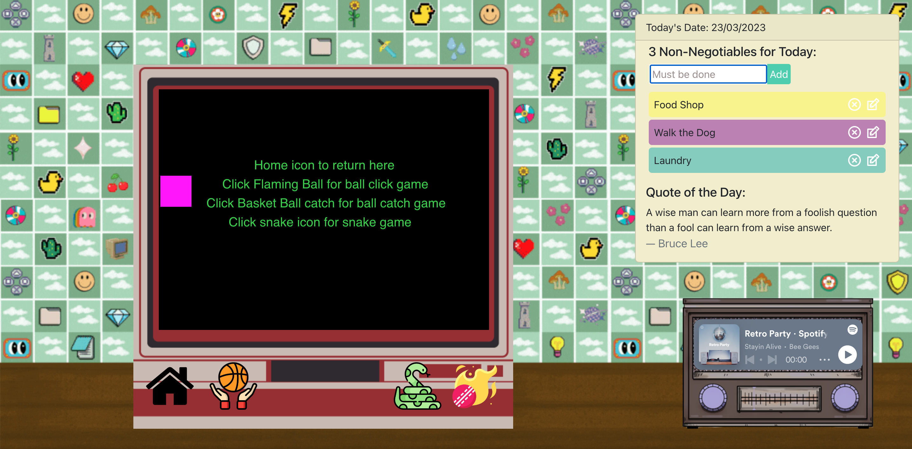
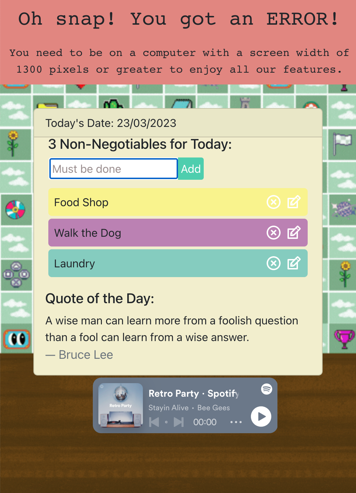

# blast-from-the-past

## A Retro Inspired Desktop Application

Blast to the Past is a desktop application that replicates the fun and excitment of some classic arcade style games. This paired with useful features like a to-do list that prioritises your non-negotiable tasks for the day, the quote of the day and an embedded customisable Spotify player, *Blast from the Past* will take you on a nostalgic journey to the golden age of arcade games. 

This application relies on various technologies including p5.js, React, web APIS, JavaScript, Bootstrap, HTML and CSS. 

## Features:

- Retro inspired arcade game UI;
- Spotify Web API integration customisable to user preference;
- To-do List feature for keeping track of your daily tasks;
- Quote of the day to provide inspiration and motivation; 

## Installation: 

1. Clone the repository on your local computer.
2. Navigate to the project directory in your terminal
3. Remember to run 'npm install' to install the necessary dependencies.
4. Run 'npm start' to start enjoying the application. 

# Usage:

When you start the application, you will be presented with the retro-inspired 90's aesthetic User Interface. From here, you can navigate to different features of this application by using your cursor to hover over the main features on the page. 

- Arcade Games: Blast from the Past offers two classic arcade games for you to play. You can easily switch between the games and save your highscore. 
- To-do List: Add, edit, remove and strikethrough tasks to keep track of your daily activities.
- Quote of the Day: Get a new inspirational quote everytime you refresh your page to help motivate and inspire you. 
- Spotify web API: Customise your desktop music experience by connecting your spotify account and choosing favourite playlists to play while using the application. 

## Screenshots:

## Full Page Screenshot

### Smallest Screen-size Screenshot

## Link to Deployed App:

https://euphonious-dasik-49e852.netlify.app/

## Credits: 

This application was created by Annie George, Josh Williams and Mariana Pritchard as part of a project for Front-End Web Development Bootcamp. It uses open source software (p5.js, React, Bootstrap, APIs, etc ). Thank you to all the contributors who have made these tools and technologies available to use. 

A special thanks to Daniel Shiffman for his boundless energy and commitment to the p5js community. Also, Rune Madse's "programming design Systems" will be a reference for many projects to come.

Daniel Shiffman's Coding Train: https://www.youtube.com/@TheCodingTrain 
Rune Madsen's "Porgramming Design Systems": https://programmingdesignsystems.com/shape/custom-shapes/index.html#custom-shapes-pANLh0l

Additionally, Brian Codex's work was extremely helpful with getting some of our UI features functional
BrianCodex/ Brian Designs on Youtube. https://github.com/briancodex/react-todo-app-v1

Lastly, a huge thank you to our instructor and our very supporting TA's, without your help, motivation, encouragement and belief in our hidden coding abilities we would not be where we are today. 
